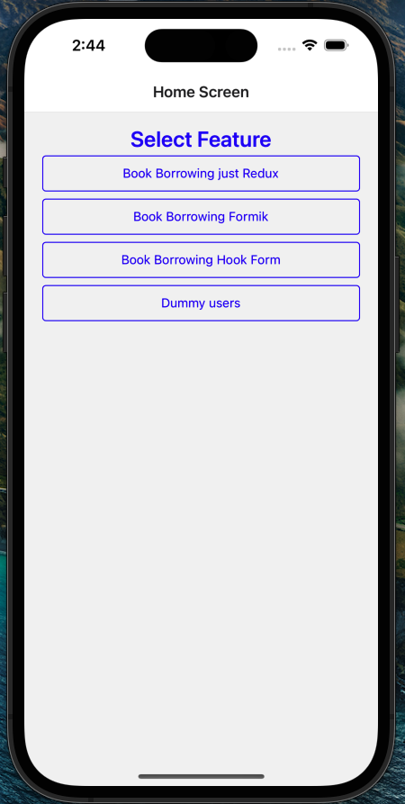

# Getting Started

I this setup, you will find a React Native app setup with most of the dependencies you will need to get started building your own React Native app.

Home Screenshot


> **Note**: Make sure you have completed the [React Native - Environment Setup](https://reactnative.dev/docs/environment-setup) instructions till "Creating a new application" step, before proceeding.

## Step 1: Install the Dependencies

First, you will need to install node modules.

```bash
# using npm
npm i

# OR using Yarn
yarn
```

## Step 2: Start the Metro Server

First, you will need to start **Metro**, the JavaScript _bundler_ that ships _with_ React Native.

To start Metro, run the following command from the _root_ of your React Native project:

```bash
# using npm
npm start

# OR using Yarn
yarn start
```

## Step 3: Start your Application

Let Metro Bundler run in its _own_ terminal. Open a _new_ terminal from the _root_ of your React Native project. Run the following command to start your _Android_ or _iOS_ app:

### For Android

```bash
# using npm
npm run android

# OR using Yarn
yarn android
```

### For iOS

```bash

npx pod-install ios

# using npm
npm run ios

# OR using Yarn
yarn ios
```

If everything is set up _correctly_, you should see your new app running in your _Android Emulator_ or _iOS Simulator_ shortly provided you have set up your emulator/simulator correctly.

This is one way to run your app — you can also run it directly from within Android Studio and Xcode respectively.

## Step 4: Run JSon Server

```bash
# using npm
npm run json

# OR using Yarn
yarn json
```

then run Ngrok

```bash
# using npm
npm run ngrok

# OR using Yarn
yarn ngrok
```

Now get the url from ngrok and replace it in the `.env` file.

Now that you have successfully run the app, let's modify it.

## Congratulations! :tada:

You've successfully run and modified your React Native App. :partying_face:

### Now what?

- You have home screen you can navigate.
- You have Dummy users .
- You have Book borrowing feature with just Redux Toolkit.
- You have Book borrowing feature with Redux Toolkit and Formik.
- You have Book borrowing feature with Redux Toolkit and React Hook Form.


Happy Coding! :heart:
